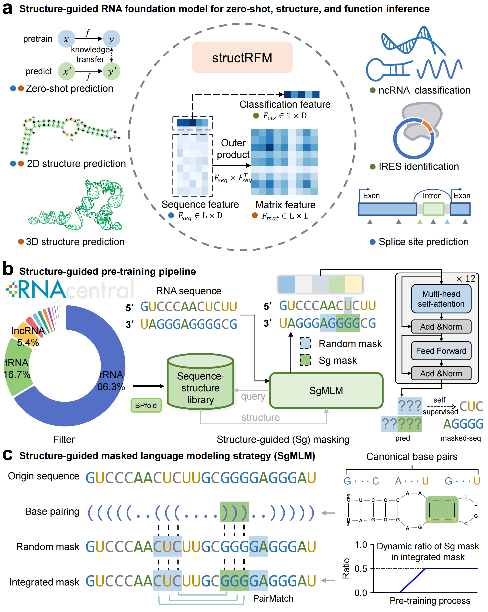

<p align="center">

  <h1 align="center">Structure-guided RNA foundation model for robust structure and function inference</h1>
  <p align="center">
    <a href="https://heqin-zhu.github.io/"><strong>Heqin Zhu</strong></a>
    ·
    <a href=""><strong>Ruifeng Li</strong></a>
    ·
    <a href="https://zaixizhang.github.io/"><strong>Zaixi Zhang</strong></a>
    ·
    <strong>Feng Zhang</strong>
    ·
    <a href="https://fenghetan9.github.io/"><strong>Fenghe Tang</strong></a>
    ·
    <strong>Tong Ye</strong>
    ·
    <strong>Yunjie Gu</strong>
    ·
    <a href="https://bme.ustc.edu.cn/2023/0322/c28131a596069/page.htm"><strong>Peng Xiong*</strong></a>
    ·
    <a href="https://scholar.google.com/citations?user=8eNm2GMAAAAJ"><strong>S. Kevin Zhou*</strong></a>
  </p>
  <h2 align="center">Submitted</h2>
  <div align="center">
    
  </div>
  <p align="center">
    <a href="https://www.nature.com/articles/s41467-025-60048-1.pdf">PDF</a> |
    <a href="https://github.com/heqin-zhu/structRFM">GitHub</a> |
    <a href="https://pypi.org/project/structRFM">PyPI</a>
  </p>
</p>


<!-- vim-markdown-toc GFM -->

    * [Abstract](#abstract)
    * [Installation](#installation)
        * [Requirements](#requirements)
        * [Instructions](#instructions)
* [TODO](#todo)
    * [Pretraining](#pretraining)
        * [Download sequence-structure dataset](#download-sequence-structure-dataset)
        * [Run pretraining](#run-pretraining)
        * [Download pretrained structRFM](#download-pretrained-structrfm)
        * [Extract RNA sequence features](#extract-rna-sequence-features)
    * [Downstream Tasks](#downstream-tasks)
        * [Zero-shot predicton](#zero-shot-predicton)
        * [Secondary structure prediction](#secondary-structure-prediction)
            * [1. Data Preparation](#1-data-preparation)
            * [2. Adaptation](#2-adaptation)
            * [3. Evaluation](#3-evaluation)
        * [Tertiary structure prediction](#tertiary-structure-prediction)
        * [Splice site prediction](#splice-site-prediction)
        * [IRES identification](#ires-identification)
        * [ncRNA classification](#ncrna-classification)
            * [1. Data Preparation](#1-data-preparation-1)
            * [2. Fine-tuning](#2-fine-tuning)
            * [3. Evaluation](#3-evaluation-1)
    * [Reproduction](#reproduction)
    * [Acknowledgement](#acknowledgement)
    * [LICENSE](#license)
    * [Citation](#citation)

<!-- vim-markdown-toc -->

## Abstract
RNA language models have achieved strong performance across diverse downstream tasks by leveraging large-scale sequence data. However, RNA function is fundamentally shaped by its hierarchical structure, making the integration of structural information into pretraining essential. Existing methods often depend on noisy structural annotations or introduce task-specific biases, limiting model generalizability. Here, we introduce structRFM, a structure-guided RNA foundation model that is pretrained by implicitly incorporating large-scale base pairing interactions and sequence data via a dynamic masking ratio to balance nucleotide-level and structure-level masking. structRFM learns joint knowledge of sequential and structural data, producing versatile representations-including classification-level, sequence-level, and pairwise matrix features-that support broad downstream adaptations. structRFM ranks top models in zero-shot homology classification across fifteen biological language models, and sets new benchmarks for secondary structure prediction, achieving F1 scores of 0.873 on ArchiveII and 0.641 on bpRNA-TS0 dataset. structRFM further enables robust and reliable tertiary structure prediction, with consistent improvements in both 3D accuracy and extracted 2D structures. In functional tasks such as internal ribosome entry site identification, structRFM achieves a 49\% performance gain. These results demonstrate the effectiveness of structure-guided pretraining and highlight a promising direction for developing multi-modal RNA language models in computational biology.


## Installation
### Requirements
- python3.8+
- anaconda

### Instructions
0. Clone this repo
```shell
git clone git@github.com:heqin-zhu/structRFM.git
cd structRFM
```
1. Create and activate conda environment.
```shell
conda env create -f environment.yaml
conda activate structRFM
```
2. Install structRFM
```shell
pip3 install structRFM
```
3. Download [checkpoint](https://github.com/heqin-zhu/BPfold/releases/latest/download/model_predict.tar.gz) in [releases](https://github.com/heqin-zhu/BPfold/releases) and decompress it.
# TODO
```shell
wget https://github.com/heqin-zhu/BPfold/releases/latest/download/model_predict.tar.gz
tar -xzf model_predict.tar.gz
```

## Pretraining

### Download sequence-structure dataset
The pretrianing sequence-structure dataset is constructed using RNAcentral and BPfold. We filter sequences with a length limited to 512, resulting about 21 millions sequence-structure paired data. It can be downloaded at [Google Drive]() or [releases from]().

### Run pretraining
```bash
bash ./run.sh --print --batch_size 128 --epoch 100 --lr 0.0001 --tag mlm --mlm_structure
```
### Download pretrained structRFM
- structRFM used in the paper: [Google Drive]() | [releases]()
- structRFM with longer pretraining time: [Google Drive]() | [releases]()

### Extract RNA sequence features

<details>

<summary>demo.py</summary>

```python
from structRFM.infer import structRFM_infer

from_pretrained = 'structRFM_checkpoint # TODO, update checkpoint path
model = structRFM_infer(from_pretrained=from_pretrained, max_length=514)

seq = 'AGUACGUAGUA'
output_attentions = True

print('seq len:', len(seq))
# (1+L+1)x 768,  [CLS] seq [SEP]
features, attentions = model.extract_feature(seq, return_all=True, output_attentions=output_attentions)

# feat  tuple: layer=12, tuple[i]: batch x L x hidden_dim(=768)
last_feat = features[-1]

# classification feature, 1x768
cls_feat = last_feat[0,:] # 1x768
# sequence feature, Lx768
feat1d = last_feat[1:-1, :] # Lx768
# matrix_feature, LxL
feat2d = feat1d @ feat1d.transpose(-1,-2) # LxL

print('classification feature:', cls_feat.shape)
print('sequence feature:', feat1d.shape)
print('matrix feature:', feat2d.shape)

# atten   tuple: layer=12, tuple[i]: batch x head(=12) x L x L
# remove special tokens
attentions = tuple([atten[:, :, 1:-1, 1:-1] for atten in attentions])
print('attentions', len(attentions), attentions[0].shape)
```

</details>

## Downstream Tasks


### Zero-shot predicton

### Secondary structure prediction
#### 1. Data Preparation

You can download training data from [Google Drive](https://drive.google.com/drive/folders/1XUBVXAUyIB6NqWmwEdLLlnWFaoU_l3XN?usp=sharing) and unzip and place them in the `./data/ft/ssp` folder. Two tasks (RNAStrAlign-ArchiveII, bpRNA1m) are available for this task.

#### 2. Adaptation

Adapt RNAErnie on RNA secondary structure prediction task with the following command:

```bash
python run_ssp.py \
    --task_name=RNAStrAlign \
    --dataset_dir=./data/ft/ssp \
    --model_name_or_path=./output/BERT,ERNIE,MOTIF,PROMPT/checkpoint_final \
    --train=True \
    --num_train_epochs=50 \
    --lr=0.001 \
    --output=./output_ft/ssp
```

**Note**: we use `interface.*.so` compiled from [mxfold2](https://github.com/mxfold/mxfold2). If you system could not run the `interface.*.so` file, you could download the source code from [here](https://github.com/mxfold/mxfold2/releases/download/v0.1.2/mxfold2-0.1.2.tar.gz) and compile it by yourself. Then copy the generated `interface.*.so` file to `./` path.

#### 3. Evaluation

Or you could download our weights of RNAErnie on RNA secondary structure prediction tasks from [Google Drive](https://drive.google.com/drive/folders/1UljS7YvDdYvWgmR7R5EdBG0OPPbkKoaB?usp=sharing) and place them in the `./output_ft/ssp` folder.

Then you could evaluate the performance with the following codes:  

```bash
python run_ssp.py \
    --task_name=RNAStrAlign \
    --dataset_dir=./data/ft/ssp \
    --train=False
```
### Tertiary structure prediction
### Splice site prediction
### IRES identification
### ncRNA classification

#### 1. Data Preparation

You can download training data from [Google Drive](https://drive.google.com/drive/folders/1flh2rXiMKIreHE2l4sbjMmwAqfURj4vv?usp=sharing) and place them in the `./data/ft/seq_cls` folder. Three datasets (nRC, lncRNA_H, lncRNA_M) are available for this task.

#### 2. Fine-tuning

Fine-tune RNAErnie on RNA sequence classification task with the following command:

```bash
python run_seq_cls.py \
    --dataset=nRC \
    --dataset_dir=./data/ft/seq_cls \
    --model_name_or_path=./output/BERT,ERNIE,MOTIF,PROMPT/checkpoint_final \
    --train=True \
    --batch_size=50 \
    --num_train_epochs=100 \
    --learning_rate=0.0001 \
    --output=./output_ft/seq_cls
```

Moreover, to train on long ncRNA classification tasks, change augument `--dataset` to `lncRNA_M` or `lncRNA_H`, and you can add the `--use_chunk=True` argument to chunk and ensemble the whole sequence.

To use two-stage fine-tuning, you can add the `--two_stage=True` argument.

#### 3. Evaluation

Or you could download our weights of RNAErnie on sequence classification tasks from [Google Drive](https://drive.google.com/drive/folders/1v7Wx6cOd7_3EGtxTAMWMjtPTwocL5w6-?usp=sharing) and place them in the `./output_ft/seq_cls` folder.

Then you could evaluate the performance with the following codes:  

```bash
python run_seq_cls.py \
    --dataset=nRC \
    --dataset_dir=./data/ft/seq_cls \
    --model_name_or_path=./output/BERT,ERNIE,MOTIF,PROMPT/checkpoint_final \
    --model_path=./output_ft/seq_cls/nRC/BERT,ERNIE,MOTIF,PROMPT/model_state.pdparams \
    --train=False \
    --batch_size=50
```

To evaluate two-stage procedure, you can add the `--two_stage=True` argument and change the `--model_path` to `./output_ft/seq_cls/nRC/BERT,ERNIE,MOTIF,PROMPT,2`.


## Reproduction
For reproduction of all the quantitative results, we provide the predicted secondary structures and model parameters of BPfold in experiments. You can **directly downalod** the predicted secondary structures by BPfold *or* **use BPfold v0.2.0** with trained parameters to predict these secondary structures, and then **evaluate** the predicted results.

**Directly download**
```shell
wget https://github.com/heqin-zhu/BPfold/releases/download/v0.2/BPfold_test_results.tar.gz
tar -xzf BPfold_test_results.tar.gz
```
**Use BPfold**
1. Download the checkpoints of BPfold: [BPfold_reproduce.tar.gz](https://github.com/heqin-zhu/BPfold/releases/download/v0.2/model_reproduce.tar.gz).
```shell
wget https://github.com/heqin-zhu/BPfold/releases/download/v0.2/model_reproduce.tar.gz
tar -xzf model_reproduce.tar.gz
```
2. Install BPfold v<=0.2.4.
```shell
pip install BPfold==0.2.4
```
3. Use BPfold to predict RNA sequences in test datasets.

**Evaluate**
```shell
BPfold_eval --gt_dir BPfold_data --pred_dir BPfold_test_results
```

After running above commands for evaluation, you will see the following outputs:

## Acknowledgement
We appreciate the following open-source projects for their valuable contributions:
- [RNAcentral](https://rnacentral.org)
- [BPfold](https://github.com/heqin-zhu/BPfold)
- [RNAErnie](https://github.com/CatIIIIIIII/RNAErnie)
- [trRosettaRNA](https://yanglab.qd.sdu.edu.cn/trRosettaRNA)
- [BEACON](https://github.com/terry-r123/RNABenchmark)
- [MXfold2](https://github.com/mxfold/mxfold2)

## LICENSE
[MIT LICENSE](LICENSE)

## Citation
If you find our work helpful, please cite our paper:
```bibtex
# TODO
```
